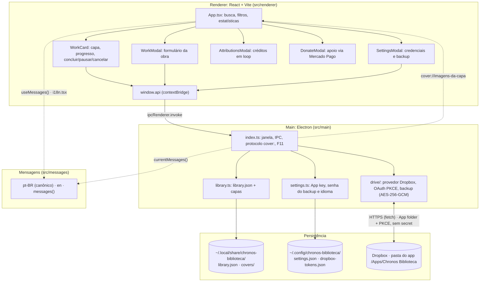
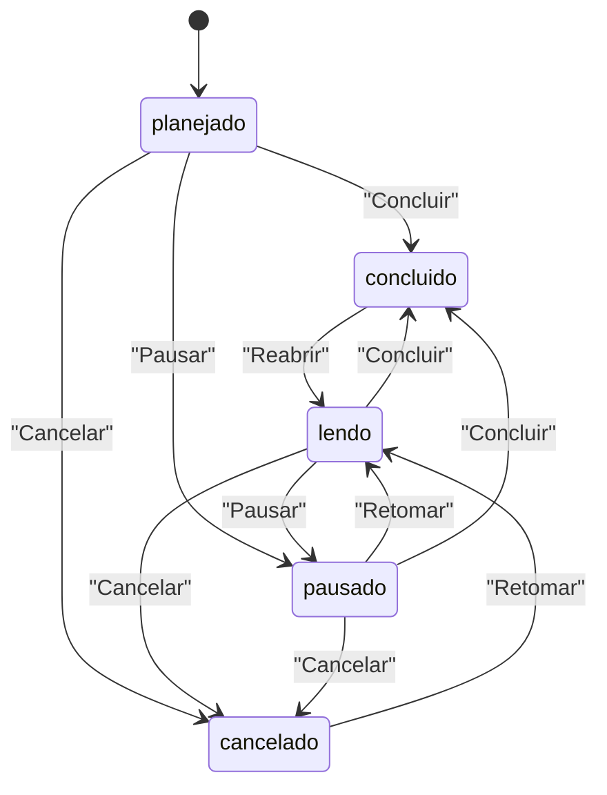
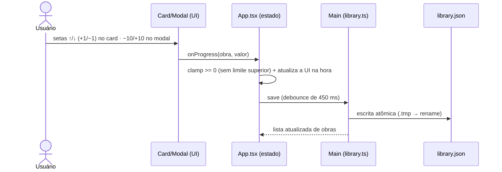
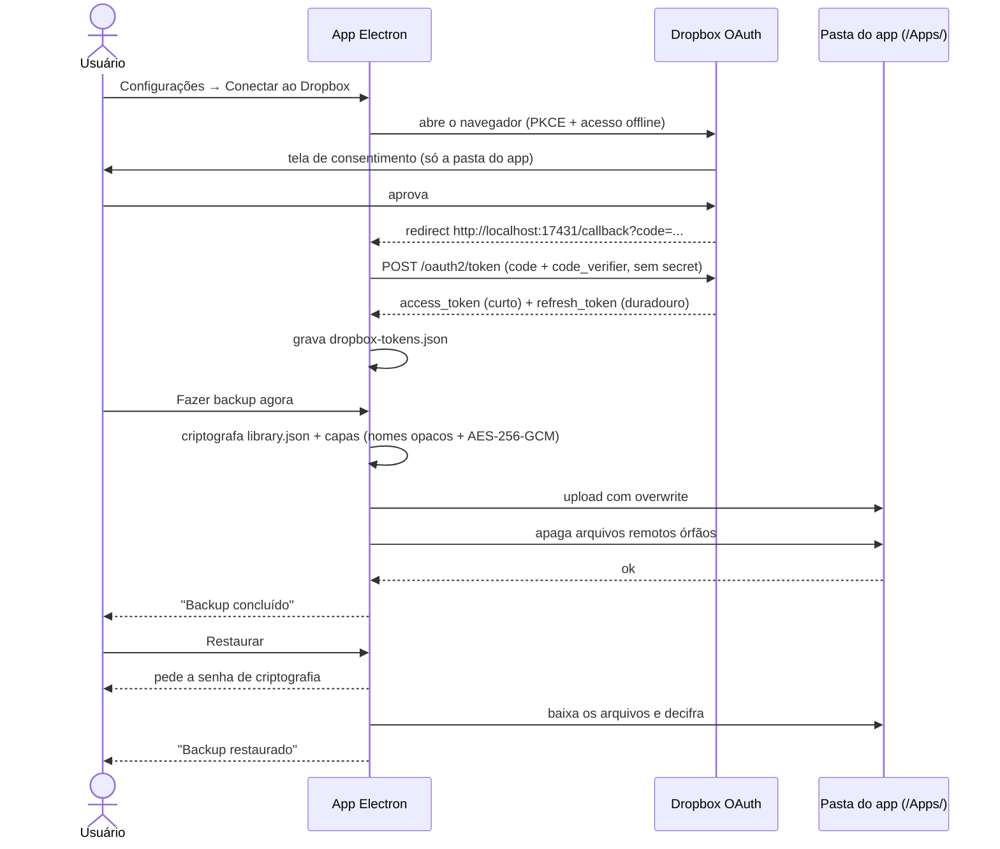

# Chronos Biblioteca

Aplicativo desktop (Electron + TypeScript + React) para anotar o progresso das suas leituras de
**webtoons, manhwas, manhuas, mangás, livros e outros**: capa da obra, título, descrição, barra de
progresso em capítulos e marcação de conclusão, com **backup manual no Dropbox** na pasta do
app.

Feito para **Linux Mint 22.3 (Zena)** e distribuído como pacote **`.deb`**.

---

## Recursos

- **Biblioteca em grade** com capa, título, tipo (webtoon/manhwa/manhua/mangá/livro/outro), status
  (planejado, lendo, pausado, concluído, cancelado) e progresso.
- **Capa da obra**: escolha uma imagem JPG/PNG/WebP do disco. A imagem é copiada para a
  biblioteca local e servida pelo protocolo interno `cover://`.
- **Título e descrição** livres, além de uma marcação opcional (`Cap. 45`, `Vol. 3`).
- **Barra de progresso** no card com setas `↑` / `↓` (ajuste de 1 em 1) e botões de status
  contextuais (**Concluir**, **Pausar**/**Retomar** e **Cancelar**), todos em uma única linha e
  compactos (só ícone, com a ação no tooltip); no modal de edição, campo numérico direto,
  `−10` / `+10`, **concluir** e **zerar**.
- **Busca** por título ou descrição e **filtros** por status (Lendo, Planejados, Pausados,
  Concluídos, Cancelados); o contador e o progresso médio do cabeçalho acompanham o que está
  sendo exibido, e o bloco de estatísticas continua mostrando o total da biblioteca.
- **Backup no Dropbox**: grava na **pasta do app** (`/Apps/Chronos Biblioteca`, um espaço
  que só este app acessa via API), com login **OAuth + PKCE direto no app** (sem segredo
  embutido e sem servidor intermediário). Arquivos sempre **criptografados** (nomes opacos +
  AES-256-GCM), com **Fazer backup agora**, **Restaurar** (pede a senha) e **Desconectar**.
- **Janela nativa sem barra de menus**: sem botões File/Edit/View no topo (menu da
  aplicação removido por completo); decorações do gerenciador de janelas (encaixe em cantos
  para dividir a tela, maximizar/fechar) e `F11` alterna tela cheia.
- **Atribuições**: botão ao lado da pílula do Drive abre os créditos das dependências em
  rolagem lenta e contínua (estilo pós-créditos de cinema), com pausar/continuar e
  respeito a `prefers-reduced-motion`; detalhes em [`docs/atribuicoes.md`](docs/atribuicoes.md).
- **Doações**: botão **Doar** no cabeçalho abre a página de apoio ao projeto, com link do
  Mercado Pago (abre no navegador) e botão de copiar; detalhes em
  [`docs/doacoes.md`](docs/doacoes.md).
- **Idioma**: interface em **português (Brasil)**, **inglês** ou **coreano**, escolhido em Configurações e
  persistido; todo texto fixo mora em `src/messages/` (ver [`docs/messages.md`](docs/messages.md)).
- Tema escuro com fundo preto (`#000`) e paleta sólida azul; ícones **Font Awesome**.

---

## Instalação

### Via repositório APT (recomendado: recebe `sudo apt upgrade`)

O repositório é a própria GitHub Release do projeto (índices assinados como
assets; nada de binário no git). Motivo da escolha, passo a passo da
publicação e regras de manutenção: [`docs/distribuicao-apt.md`](docs/distribuicao-apt.md).

Na primeira instalação:

```bash
curl -fsSL https://github.com/chronos-atalante/chronos-biblioteca/releases/latest/download/public.key \
  | sudo gpg --dearmor --yes -o /usr/share/keyrings/chronos.gpg
echo "deb [arch=amd64 signed-by=/usr/share/keyrings/chronos.gpg] \
https://github.com/chronos-atalante/chronos-biblioteca/releases/latest/download/ ./" \
  | sudo tee /etc/apt/sources.list.d/chronos.list
sudo apt update && sudo apt install chronos-biblioteca
```

### Download direto

Baixe o `.deb` da [página de Releases](https://github.com/chronos-atalante/chronos-biblioteca/releases)
(baixar direto:
`https://github.com/chronos-atalante/chronos-biblioteca/releases/latest/download/chronos-biblioteca_amd64.deb`)
e instale:

```bash
sudo apt install ./chronos-biblioteca_amd64.deb
```

### Compilando localmente

```bash
# gere o pacote (uma vez)
npm install
npm run dist

# instale
sudo apt install ./release/chronos-biblioteca_*_amd64.deb
```

O aplicativo aparece no menu do sistema como **Chronos Biblioteca**.

- Executável: `/opt/Chronos Biblioteca/chronos-biblioteca` (alternativa
  `/usr/bin/chronos-biblioteca`)
- Ícone instalado em `/usr/share/icons/hicolor/512x512/apps/chronos-biblioteca.png`
- Dados: obras e capas em `~/.local/share/chronos-biblioteca/` (`library.json`, `covers/`);
  configurações e tokens em `~/.config/chronos-biblioteca/` (`settings.json`,
  `dropbox-tokens.json`)

---

## Comandos de desenvolvimento

| Comando                  | O que faz                                          |
| ------------------------ | -------------------------------------------------- |
| `npm run dev`            | Sobe o app em modo desenvolvimento (hot reload)    |
| `npm run typecheck`      | `tsc --noEmit` nos projetos node, web e testes     |
| `npm run lint`           | ESLint rigoroso (type-aware) em todo o repositório |
| `npm run lint:fix`       | ESLint com correção automática                     |
| `npm run format`         | Formata tudo com Prettier                          |
| `npm run format:check`   | Verifica a formatação (CI)                         |
| `npm test`               | Roda a suíte Vitest (`tests/**/*.test.{ts,tsx}`)   |
| `npm run security:audit` | Auditoria de vulnerabilidades via OSV Scanner      |
| `npm run check`          | `typecheck` + `lint` + `format:check` + auditoria  |
| `npm run clean`          | Apaga `out/` (build anterior)                      |
| `npm run build`          | Limpa + compila main/preload/renderer              |
| `npm run dist`           | Build + gera o `.deb` com electron-builder         |

---

## Qualidade de código

O projeto roda com o máximo de rigor disponível:

**TypeScript (`tsconfig.base.json`)**

```jsonc
"strict": true,
"module": "nodenext",                // ESM em src/ (src/package.json "type": "module")
"allowImportingTsExtensions": true,  // noEmit: permite candidatos de paths com .ts/.tsx
"noUncheckedIndexedAccess": true,   // acesso a índice vira T | undefined
"exactOptionalPropertyTypes": true, // opcional ≠ undefined explícito
"noImplicitReturns": true,
"noImplicitOverride": true,
"noUnusedLocals": true,
"noUnusedParameters": true,
"noFallthroughCasesInSwitch": true,
"allowUnreachableCode": false,
"verbatimModuleSyntax": true        // imports de tipo obrigatoriamente `import type`
```

**ESLint (`eslint.config.mjs`)**

- `typescript-eslint` nos perfis **`strictTypeChecked`** + **`stylisticTypeChecked`** (analisa
  tipos reais, não só sintaxe).
- Regras extras sempre em **`error`**: `no-floating-promises`, `no-misused-promises`,
  `no-unsafe-*` (assignment/argument/call/member-access/return), `no-unnecessary-condition`,
  `strict-boolean-expressions` (sem coerção implícita: `if (str)` é proibido, use
  `str === ''`), `explicit-function-return-type`, `explicit-member-accessibility`,
  `require-await`, `switch-exhaustiveness-check`, `no-deprecated` etc.
- `eslint-plugin-react-hooks` com `rules-of-hooks` e `exhaustive-deps` em `error`.
- `eslint-config-prettier` desliga apenas o que conflita com a formatação.

**Prettier (`.prettierrc.json`)**: 100 colunas, aspas simples, ponto e vírgula, vírgula final,
2 espaços. Rode `npm run check` antes de commitar.

---

## Imports e aliases

Dentro de `src/` **não existe import relativo**: todo módulo é referenciado por um alias ESM
`@zero/*`. O mapa é declarado uma única vez em `tsconfig.base.json` e espelhado nos três
resolvers que o projeto usa (build, testes e Node puro):

| Alias              | Alvo                     | Onde é resolvido                                        |
| ------------------ | ------------------------ | ------------------------------------------------------- |
| `@zero/types`      | `src/types/` (barrel)    | `electron.vite.config.mts`, `vitest.config.mts`, loader |
| `@zero/types/*`    | `src/types/*`            | `tsconfig.base.json`                                    |
| `@zero/messages`   | `src/messages/` (barrel) | `electron.vite.config.mts`, `vitest.config.mts`, loader |
| `@zero/messages/*` | `src/messages/*`         | `tsconfig.base.json`                                    |
| `@zero/main/*`     | `src/main/*`             | `electron.vite.config.mts`, `vitest.config.mts`, loader |
| `@zero/preload/*`  | `src/preload/*`          | `electron.vite.config.mts`, `vitest.config.mts`, loader |
| `@zero/renderer/*` | `src/renderer/src/*`     | `electron.vite.config.mts`, `vitest.config.mts`, loader |

- **Build** (`npm run dev` / `npm run build`): electron-vite (Vite) resolve os aliases.
- **Testes** (`npm test`): vitest resolve os mesmos aliases.
- Com `module: nodenext`, os candidatos de `paths` em `tsconfig.base.json` declaram a extensão
  (`.ts` / `.tsx` / `index.tsx`); `allowImportingTsExtensions: true` (que exige `noEmit`) é o
  que permite isso sem erro de import.
- **Node puro** (sem bundler): o loader `src/node.loader.ts` registra hooks de resolução com
  `module.registerHooks()`: hooks **síncronos, na mesma thread** (estáveis desde o
  Node 22.15/23.5). O caminho antigo, `module.register()` com hooks assíncronos em thread
  separada (o antigo `--experimental-loader`), está **deprecado** desde o Node 25.9.

```bash
# roda um arquivo .ts direto, com os aliases @zero/* funcionando
node --import ./src/node.loader.ts caminho/para/arquivo.ts
```

O loader só precisa dos aliases: o Node já remove as anotações de tipo dos `.ts` sozinho.
`src/package.json` **e a raiz** declaram `"type": "module"`: o Node lê `src/` como ESM e o
electron-vite emite `out/main/index.js` (ESM). O preload sai como **CommonJS**
(`out/preload/index.cjs`), porque o Electron roda preload **sandboxed** como script simples, sem
loader ESM; por isso `electron.vite.config.mts` fixa `format: 'cjs'` no build de `preload`.
`preloadScript()` em `src/main/index.ts` resolve `index.cjs`, `index.mjs` ou `index.js` nessa
ordem.

---

## Arquitetura



### Estados de uma obra



Os botões do card mostram as transições válidas para o status atual (uma obra `cancelada` só
oferece **Retomar**; uma `concluída`, só **Reabrir**). No modal de edição, o Select de **Status**
permite ir de qualquer estado para qualquer outro, e **Zerar** volta o progresso para 0 e o status
para `planejado`. Mexer no progresso de uma obra `concluída` a devolve para `lendo`.

Progresso e status são independentes: marcar `concluido` **não** altera o número salvo, o card
apenas passa a exibir `100%` (use **Zerar** no modal para voltar a 0).

### Fluxo do progresso (anotação contínua)



---

## Estrutura do projeto

```
Webtoons/
├── build/
│   ├── icon.png              # ícone 512×512 usado no .deb
│   └── make-icon.py          # gerador do ícone (PIL)
├── docs/
│   ├── dropbox.md              # guia do backup + diagramas
│   ├── backup-providers.md     # provedores de nuvem (Dropbox · Google Drive)
│   ├── distribuicao-apt.md     # distribuição: Release + repo APT flat assinado
│   ├── messages.md             # i18n: bundles pt-BR/en/ko e o que não se traduz
│   ├── atribuicoes.md        # página de Atribuições (créditos em loop)
│   ├── doacoes.md            # página de Doações (Mercado Pago)
│   └── api.md                # referência da API interna
├── src/
│   ├── main/                 # processo main (Electron)
│   │   ├── index.ts          # janela, IPC, protocolo cover://, F11 em tela cheia
│   │   ├── library.ts        # library.json + cópia/limpeza de capas
│   │   ├── settings.ts       # App key, senha do backup e idioma
│   │   ├── i18n.ts           # currentMessages() (idioma corrente no main)
│   │   └── drive/            # provedores de nuvem, OAuth PKCE, backup/restauração
│   │       ├── index.ts      # barrel da API pública (authorize, backupNow…)
│   │       ├── provider.ts   # contrato BackupProvider + catálogo de provedores
│   │       ├── providers/    # dropbox.ts (operante) · google-drive.ts (não operante)
│   │       ├── constants.ts  # escopos, App key, loopback fixo
│   │       ├── state.ts      # sessão, App key e listener de status
│   │       ├── oauth.ts      # autorização (PKCE sem secret) + refresh
│   │       ├── rest.ts       # chamadas REST do Dropbox (pasta do app)
│   │       ├── json.ts       # leitura tipada de corpos JSON (`parseJson`)
│   │       ├── crypto.ts     # AES-256-GCM do backup
│   │       └── backup.ts     # backup, restauração e desconexão
│   ├── messages/             # textos do app (i18n): pt-BR (canônico) + en + ko
│   │   ├── index.ts          # LANGUAGES, LANGUAGE_LABELS, messages()
│   │   ├── pt-BR.ts          # bundle canônico + tipo Messages
│   │   ├── en.ts             # tradução tipada contra Messages
│   │   └── ko.ts             # tradução tipada contra Messages
│   ├── preload/index.ts      # contextBridge (window.api)
│   ├── renderer/             # React + Vite
│   │   ├── index.html        # CSP com scheme cover:
│   │   └── src/              # App, i18n.tsx (contexto de idioma), componentes, donations.ts, style/styles.css
│   ├── types/                # tipos compartilhados main ↔ renderer (@zero/types)
│   │   ├── index.ts          # barrel (arquivo index só como barrel)
│   │   ├── work.ts           # Work, WorkType, WorkStatus
│   │   ├── settings.ts       # AppSettings
│   │   ├── drive.ts          # DriveStatus, BackupSummary
│   │   └── api.ts            # ElectronApi (contrato do preload)
│   ├── node.loader.ts        # hooks module.registerHooks() dos aliases @zero/*
│   └── package.json          # "type": "module" (Node executa src/ direto)
├── tests/
│   ├── main/                 # drive-auth, drive-backup, drive-info (<500 linhas cada)
│   ├── helpers/              # fixtures, sandbox, drive (FakeDropbox + stubFetch)
│   └── mocks/                # mock do electron para o Vitest
├── .github/
│   ├── workflows/            # CodeQL, agradecimento, publicação do .deb
│   ├── ISSUE_TEMPLATE/       # formulários de bug e de funcionalidade
│   ├── dependabot.yml        # deps e actions atualizadas semanalmente
│   └── pull_request_template.md
├── eslint.config.mjs
├── .prettierrc.json
├── tsconfig*.json
└── electron.vite.config.mts
```

---

## Empacotamento (.deb)


Detalhes da configuração (campo `build` do `package.json`):

- Alvo exclusivo `deb`, `executableName: chronos-biblioteca`
- `desktopName` + `syncDesktopName` para o `StartupWMClass` casar com a janela (associação
  correta no menu/ALT+TAB do Mint)
- Ícone empacotado em `usr/share/icons/hicolor/512x512/apps/`
- `homepage` no `package.json` aponta para o repositório
  (`https://github.com/chronos-atalante/chronos-biblioteca`): o alvo `deb` do
  electron-builder exige uma URL no campo `Homepage:` do controle do pacote
- `postinst` do electron-builder cuida do AppArmor (Ubuntu/Mint 24+) e do `chrome-sandbox`
- Slim via `afterPack` (`build/after-pack.cjs`): remove do pacote locales não usados
  (mantém `pt-BR`/`pt-PT`/`en-US`), SwiftShader/Vulkan e `libffmpeg` (o app é DOM/CSS
  estático, sem WebGL nem mídia), o que economiza ~5 MB no `.deb`, margem contra o
  limite de 100 MiB por arquivo do GitHub

---

## Backup no Dropbox

Fluxo resumido (passo a passo completo em [`docs/dropbox.md`](docs/dropbox.md)):

1. ⚙ → defina a **senha de criptografia do backup** (obrigatória). A App key do Dropbox já
   vem embutida no app (com PKCE não existe segredo: só a chave identifica o app, e o
   acesso real fica no `refresh_token` guardado na sua máquina).
2. **Conectar ao Dropbox** → janela do navegador → consentimento → tokens guardados
   localmente em `dropbox-tokens.json` (PKCE + callback fixo em `localhost:17431`, a URI
   que o Dropbox exige pré-cadastrada).
3. **Fazer backup agora** → `library.json` + capas sobem **sempre criptografados**
   (AES-256-GCM, nomes de arquivo opacos via HMAC) para a **pasta do app**
   (`/Apps/Chronos Biblioteca`). A pasta aparece na sua conta, mas só este app a acessa
   via API, e mesmo bisbilhotando, só há blobs sem nome legível.
4. **Restaurar** → pede a **senha de criptografia**, baixa o backup e substitui a biblioteca
   local.



---

## Ícone

`build/icon.png` (512×512, gerado por `build/make-icon.py`: livro aberto + barra de progresso
sobre fundo azul sólido). É ele que vira o ícone do pacote `.deb` e do lançador de menu. Para
regenerar:

```bash
python3 build/make-icon.py
```

---

## Documentação

Guias e referências (tudo em pt-BR):

| Documento                                              | Conteúdo                                                         |
| ------------------------------------------------------ | ---------------------------------------------------------------- |
| [`docs/dropbox.md`](docs/dropbox.md)                   | Guia do backup: OAuth PKCE, App folder, troubleshooting          |
| [`docs/backup-providers.md`](docs/backup-providers.md) | Provedores de backup: contrato, catálogo e Google Drive oculto   |
| [`docs/distribuicao-apt.md`](docs/distribuicao-apt.md) | Distribuição: Release, repo APT flat assinado e fluxo de release |
| [`docs/atribuicoes.md`](docs/atribuicoes.md)           | Página de Atribuições: créditos em loop e licenças               |
| [`docs/doacoes.md`](docs/doacoes.md)                   | Página de Doações: Mercado Pago                                  |
| [`docs/messages.md`](docs/messages.md)                 | i18n: bundles de mensagens (pt-BR/en/ko) e regras de tradução    |
| [`docs/api.md`](docs/api.md)                           | Referência da API interna (`window.api` + canais IPC)            |
| [`docs/openapi.yaml`](docs/openapi.yaml)               | Mesma API em OpenAPI 3.1 (abre em Swagger UI/Redoc)              |
| [`CHANGELOG.md`](CHANGELOG.md)                         | Histórico de mudanças por versão                                 |
| [`CONTRIBUTING.md`](CONTRIBUTING.md)                   | Como contribuir (ambiente, scripts, convenções)                  |
| [`CODE_OF_CONDUCT.md`](CODE_OF_CONDUCT.md)             | Código de conduta da comunidade                                  |
| [`SECURITY.md`](SECURITY.md)                           | Política de segurança e como reportar falhas                     |

---

## Licença

[MIT](LICENSE); o texto integral está em [`LICENSE`](LICENSE).
