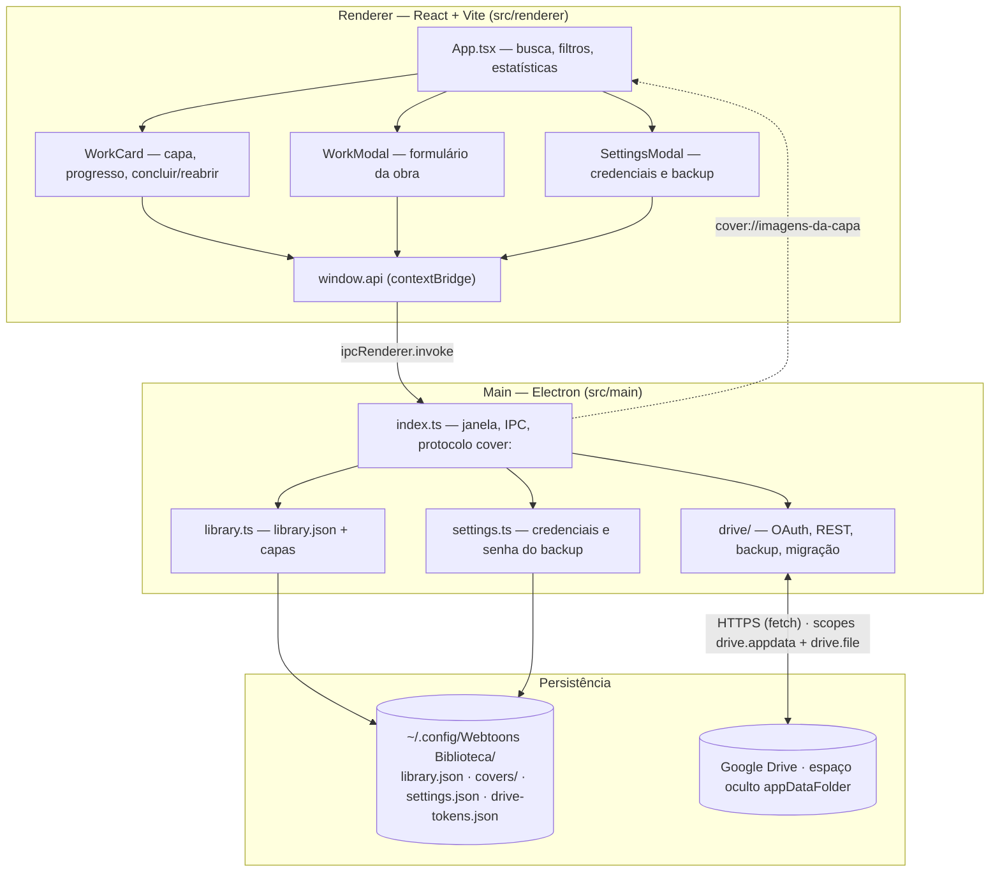
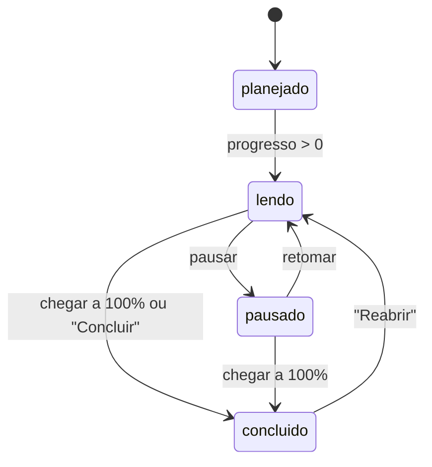
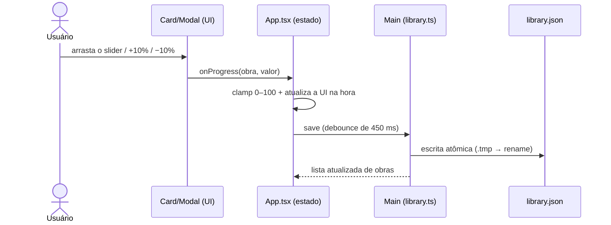
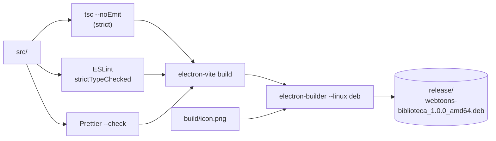
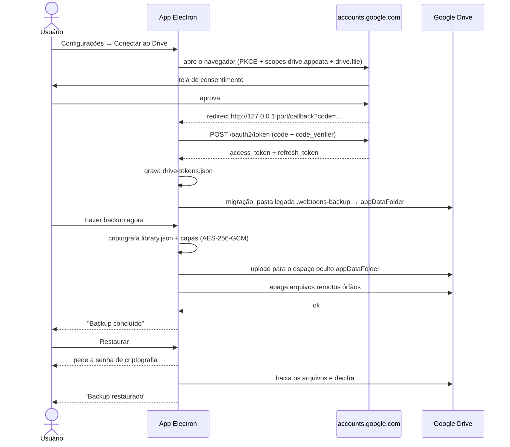

# Webtoons Biblioteca

Aplicativo desktop (Electron + TypeScript + React) para anotar o progresso das suas leituras de
**webtoons, manhwas, manhuas, mangás e livros**: capa da obra, título, descrição, barra de
progresso
em porcentagem e marcação de conclusão — com **backup manual no Google Drive** em um espaço
oculto.

Feito para **Linux Mint 22.3 (Zena)** e distribuído como pacote **`.deb`**.

---

## Recursos

- **Biblioteca em grade** com capa, título, tipo (webtoon/manhwa/manhua/mangá/livro), status e
  progresso.
- **Capa da obra**: escolha uma imagem JPG/PNG/WebP do disco — ela é copiada para a biblioteca
  local e servida pelo protocolo interno `cover://`.
- **Título e descrição** livres, além de uma marcação opcional (`Cap. 45`, `Vol. 3`).
- **Barra de progresso** com botões rápidos `−10` / `+10`, campo numérico direto e **concluir**
  (100%) / **zerar**.
- **Busca** por título ou descrição e **filtros** por status (Lendo, Planejados, Pausados,
  Concluídos) com estatísticas no topo.
- **Backup no Google Drive**: espaço **oculto `appDataFolder`** (invisível na interface do
  Drive), OAuth direto no app com **credenciais embutidas** (sem configuração prévia), arquivos
  sempre **criptografados**, com **Fazer backup agora**, **Restaurar** (pede a senha) e
  **Desconectar**.
- Tema escuro com fundo preto (`#000`) e paleta sólida azul; ícones **Font Awesome**.

---

## Instalação

```bash
# gere o pacote (uma vez)
npm install
npm run dist

# instale
sudo apt install ./release/webtoons-biblioteca_1.0.0_amd64.deb
```

O aplicativo aparece no menu do sistema como **Webtoons Biblioteca**.

- Executável: `/opt/Webtoons Biblioteca/webtoons-biblioteca` (alternativa
  `/usr/bin/webtoons-biblioteca`)
- Ícone instalado em `/usr/share/icons/hicolor/512x512/apps/webtoons-biblioteca.png`
- Dados: `~/.config/Webtoons Biblioteca/` (`library.json`, `covers/`, `settings.json`,
  `drive-tokens.json`)

---

## Comandos de desenvolvimento

| Comando                | O que faz                                          |
| ---------------------- | -------------------------------------------------- |
| `npm run dev`          | Sobe o app em modo desenvolvimento (hot reload)    |
| `npm run typecheck`    | `tsc --noEmit` nos projetos node, web e testes     |
| `npm run lint`         | ESLint rigoroso (type-aware) em todo o repositório |
| `npm run lint:fix`     | ESLint com correção automática                     |
| `npm run format`       | Formata tudo com Prettier                          |
| `npm run format:check` | Verifica a formatação (CI)                         |
| `npm run check`        | `typecheck` + `lint` + `format:check` + auditoria  |
| `npm run build`        | Compila main/preload/renderer com electron-vite    |
| `npm run dist`         | Build + gera o `.deb` com electron-builder         |

---

## Qualidade de código

O projeto roda com o máximo de rigor disponível:

**TypeScript (`tsconfig.base.json`)**

```jsonc
"strict": true,
"module": "nodenext",                // ESM em src/ (src/package.json "type": "module")
"allowImportingTsExtensions": true,  // noEmit: permite candidatos de paths com .ts/.tsx
"noUncheckedIndexedAccess": true,   // acesso a índice vira T | undefined
"exactOptionalPropertyTypes": true, // opcional ≠ undefined explícito
"noImplicitReturns": true,
"noImplicitOverride": true,
"noUnusedLocals": true,
"noUnusedParameters": true,
"noFallthroughCasesInSwitch": true,
"allowUnreachableCode": false,
"verbatimModuleSyntax": true        // imports de tipo obrigatoriamente `import type`
```

**ESLint (`eslint.config.mjs`)**

- `typescript-eslint` nos perfis **`strictTypeChecked`** + **`stylisticTypeChecked`** (analisa
  tipos reais, não só sintaxe).
- Regras extras sempre em **`error`**: `no-floating-promises`, `no-misused-promises`,
  `no-unsafe-*` (assignment/argument/call/member-access/return), `no-unnecessary-condition`,
  `strict-boolean-expressions` (sem coerção implícita: `if (str)` é proibido, use
  `str === ''`), `explicit-function-return-type`, `explicit-member-accessibility`,
  `require-await`, `switch-exhaustiveness-check`, `no-deprecated` etc.
- `eslint-plugin-react-hooks` com `rules-of-hooks` e `exhaustive-deps` em `error`.
- `eslint-config-prettier` desliga apenas o que conflita com a formatação.

**Prettier (`.prettierrc.json`)** — 100 colunas, aspas simples, ponto e vírgula, vírgula final,
2 espaços. Rode `npm run check` antes de commitar.

---

## Imports e aliases

Dentro de `src/` **não existe import relativo**: todo módulo é referenciado por um alias ESM
`@zero/*`. O mapa é declarado uma única vez em `tsconfig.base.json` e espelhado nos três
resolvers que o projeto usa (build, testes e Node puro):

| Alias              | Alvo                  | Onde é resolvido                                        |
| ------------------ | --------------------- | ------------------------------------------------------- |
| `@zero/types`      | `src/types/` (barrel) | `electron.vite.config.mts`, `vitest.config.mts`, loader |
| `@zero/types/*`    | `src/types/*`         | `tsconfig.base.json`                                    |
| `@zero/main/*`     | `src/main/*`          | `electron.vite.config.mts`, `vitest.config.mts`, loader |
| `@zero/preload/*`  | `src/preload/*`       | `electron.vite.config.mts`, `vitest.config.mts`, loader |
| `@zero/renderer/*` | `src/renderer/src/*`  | `electron.vite.config.mts`, `vitest.config.mts`, loader |

- **Build** (`npm run dev` / `npm run build`): electron-vite (Vite) resolve os aliases.
- **Testes** (`npm test`): vitest resolve os mesmos aliases.
- Com `module: nodenext`, os candidatos de `paths` em `tsconfig.base.json` declaram a extensão
  (`.ts` / `.tsx` / `index.tsx`); `allowImportingTsExtensions: true` (que exige `noEmit`) é o
  que permite isso sem erro de import.
- **Node puro** (sem bundler): o loader `src/node.loader.ts` registra hooks de resolução com
  `module.registerHooks()` — hooks **síncronos, na mesma thread** (estáveis desde o
  Node 22.15/23.5). O caminho antigo, `module.register()` com hooks assíncronos em thread
  separada (o antigo `--experimental-loader`), está **deprecado** desde o Node 25.9.

```bash
# roda um arquivo .ts direto, com os aliases @zero/* funcionando
node --import ./src/node.loader.ts caminho/para/arquivo.ts
```

O loader só precisa dos aliases: o Node já remove as anotações de tipo dos `.ts` sozinho.
`src/package.json` declara `"type": "module"` para que o Node interprete os arquivos de `src/`
como ESM — a raiz continua `"type": "commonjs"`, porque o `out/main/index.js` gerado pelo
electron-vite é CommonJS.

---

## Arquitetura



### Estados de uma obra



Regra única e simples no salvamento: **status `concluido` força progresso 100%** (e o slider em
100% marca a obra como concluída).

### Fluxo do progresso (anotação contínua)



---

## Estrutura do projeto

```
Webtoons/
├── build/
│   ├── icon.png              # ícone 512×512 usado no .deb
│   └── make-icon.py          # gerador do ícone (PIL)
├── docs/
│   └── google-drive.md       # guia do backup + diagramas
├── src/
│   ├── main/                 # processo main (Electron)
│   │   ├── index.ts          # janela, IPC, protocolo cover://
│   │   ├── library.ts        # library.json + cópia/limpeza de capas
│   │   ├── settings.ts       # credenciais OAuth
│   │   └── drive/            # OAuth, Drive REST, backup/restauração
│   │       ├── index.ts      # barrel da API pública (authorize, backupNow…)
│   │       ├── constants.ts  # escopos, credenciais embutidas, appDataFolder
│   │       ├── state.ts      # tokens, status e listener
│   │       ├── oauth.ts      # autorização (PKCE) + refresh do token
│   │       ├── rest.ts       # chamadas REST do Drive (appDataFolder)
│   │       ├── migrate.ts    # migração da pasta legada .webtoons-backup
│   │       ├── crypto.ts     # AES-256-GCM do backup
│   │       └── backup.ts     # backup, restauração e desconexão
│   ├── preload/index.ts      # contextBridge (window.api)
│   ├── renderer/             # React + Vite
│   │   ├── index.html        # CSP com scheme cover:
│   │   └── src/              # App, componentes, styles.css
│   ├── types/                # tipos compartilhados main ↔ renderer (@zero/types)
│   │   ├── index.ts          # barrel (arquivo index só como barrel)
│   │   ├── work.ts           # Work, WorkType, WorkStatus
│   │   ├── settings.ts       # AppSettings
│   │   ├── drive.ts          # DriveStatus, BackupSummary
│   │   └── api.ts            # ElectronApi (contrato do preload)
│   ├── node.loader.ts        # hooks module.registerHooks() dos aliases @zero/*
│   └── package.json          # "type": "module" (Node executa src/ direto)
├── eslint.config.mjs
├── .prettierrc.json
├── tsconfig*.json
└── electron.vite.config.mts
```

---

## Empacotamento (.deb)



Detalhes da configuração (campo `build` do `package.json`):

- Alvo exclusivo `deb`, `executableName: webtoons-biblioteca`
- `desktopName` + `syncDesktopName` para o `StartupWMClass` casar com a janela (associação
  correta no menu/ALT+TAB do Mint)
- Ícone empacotado em `usr/share/icons/hicolor/512x512/apps/`
- `postinst` do electron-builder cuida do AppArmor (Ubuntu/Mint 24+) e do `chrome-sandbox`

---

## Backup no Google Drive

Fluxo resumido (passo a passo completo em [`docs/google-drive.md`](docs/google-drive.md)):

1. ⚙ → defina a **senha de criptografia do backup** (obrigatória). As credenciais OAuth já vêm
   **embutidas** no app — não é preciso criar nada no Google Cloud Console (os campos de
   Client ID/Secret são opcionais, para quem tem projeto próprio).
2. **Conectar ao Drive** → janela do navegador → consentimento → tokens guardados localmente em
   `drive-tokens.json` (PKCE + loopback em `127.0.0.1`).
3. **Fazer backup agora** → `library.json` + capas, **sempre criptografadas** (AES-256-GCM), no
   espaço **oculto `appDataFolder`** — invisível na interface do Drive e acessível só por este
   app (escopos `drive.appdata` + `drive.file`).
4. **Restaurar** → pede a **senha de criptografia**, baixa o backup e substitui a biblioteca
   local.
5. **Migração automática**: backups antigos na pasta `.webtoons-backup` são movidos para o
   `appDataFolder` e a pasta antiga é apagada após a primeira conexão.



---

## Ícone

`build/icon.png` (512×512, gerado por `build/make-icon.py` — livro aberto + barra de progresso
sobre fundo azul sólido). É ele que vira o ícone do pacote `.deb` e do lançador de menu. Para
regenerar:

```bash
python3 build/make-icon.py
```

---

## Licença

MIT
