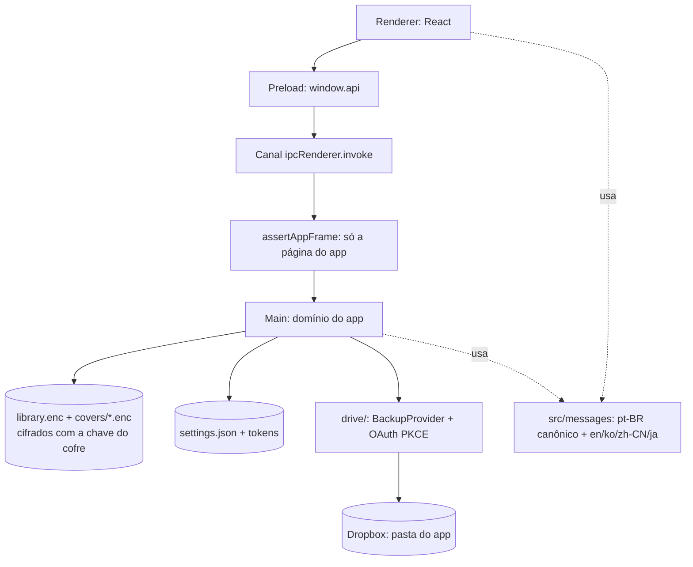

# Arquitetura



O renderer é uma interface sem privilégio: ele não abre arquivo, não usa Node e
não fala com a rede. Tudo que importa acontece no processo main, e o preload é a
única ponte.

## Camadas

| Pasta           | Papel                                                              | Arquivo principal                |
| --------------- | ------------------------------------------------------------------ | -------------------------------- |
| `src/main/`     | Janela, IPC, protocolos, persistência e backup em nuvem            | `index.ts`, `protocols.ts`       |
| `src/preload/`  | Fachada `window.api` registrada no `contextBridge` (build CJS)     | `index.ts` (entrypoint)          |
| `src/renderer/` | Interface React: grade, modais, configurações e contexto de idioma | `App.tsx`                        |
| `src/types/`    | Contratos compartilhados (`Work`, `AppSettings`, `ElectronApi`)    | `index.ts` (barrel)              |
| `src/messages/` | Textos em pt-BR (canônico), en, ko, zh-CN e ja                     | `pt-BR.ts`, `index.ts`           |
| `tests/`        | Suíte Vitest (ambiente jsdom, `electron` mockado)                  | `tests/main/`, `tests/renderer/` |

Regras de organização: arquivo `index.ts` só reexporta (exceto os dois
entrypoints que o Electron exige) e arquivo no teto de ~500 linhas é quebrado.

### Módulos do processo main

| Arquivo                 | Papel                                                                                            |
| ----------------------- | ------------------------------------------------------------------------------------------------ |
| `index.ts`              | Entrypoint: janela, política da sessão, canais IPC, push de status e ciclo de vida               |
| `protocols.ts`          | Schemes `cover://` (capas) e `cronologia://` (SPA em produção), registrados na importação        |
| `library.ts`            | acervo cifrado (`library.enc`, `covers/*.enc`) e reset destrutivo                                |
| `store-crypto.ts`       | formato `CLIB1` (AES-256-GCM) e derivação da chave do acervo por HKDF                            |
| `shred.ts`              | sobrescrita segura antes de apagar                                                               |
| `cleanup.ts`            | legados em claro e `.tmp` órfãos no boot                                                         |
| `settings.ts`           | `settings.json`: App key, senha de backup e idioma                                               |
| `jsonfile.ts`           | Escrita atômica (`writeJsonAtomic`) com modo de permissão                                        |
| `paths.ts`              | Diretórios XDG de dados, configuração e cache do app                                             |
| `i18n.ts`               | `currentMessages()`: bundle do idioma corrente no main                                           |
| `external.ts`           | `openExternalSafe`: `shell.openExternal` só para `https:`                                        |
| `drive/index.ts`        | Barrel da API pública do backup (authorize, backupNow, restoreNow…)                              |
| `drive/provider.ts`     | Contrato `BackupProvider`, catálogo e `currentProvider()`                                        |
| `drive/providers/`      | Adaptadores: `dropbox.ts` (operante), `google-drive.ts` (não operante)                           |
| `drive/oauth.ts`        | Autorização PKCE + loopback + refresh                                                            |
| `drive/rest.ts`         | Chamadas REST do Dropbox (pasta do app)                                                          |
| `drive/crypto.ts`       | AES-256-GCM do backup e nomes opacos (HMAC)                                                      |
| `drive/backup.ts`       | Orquestração de backup/restauração/desconexão                                                    |
| `drive/state.ts`        | Sessão em memória + persistência dos tokens no cofre                                             |
| `drive/restore-lock.ts` | Trava contra restauração concorrente                                                             |
| `vault/`                | Cofre (`/var/lib`): `crypto`, `container`, `lockout`, `session`, `vault`, `secrets`, `privilege` |

## Aliases `@zero/*`

Imports dentro de `src/` nunca usam caminho relativo entre pastas; sempre
`@zero/main/library`, `@zero/renderer/i18n`, `@zero/types` e assim por diante.
O mapa é declarado uma vez em `tsconfig.base.json` e espelhado em três outros
arquivos, que precisam mudar juntos:

| Arquivo                    | Para que serve                                  |
| -------------------------- | ----------------------------------------------- |
| `tsconfig.base.json`       | Fonte da verdade (`paths`) para typecheck       |
| `electron.vite.config.mts` | Bundle de main, preload e renderer              |
| `vitest.config.mts`        | Suíte (mapeia `electron` para o mock)           |
| `src/node.loader.ts`       | `node --import ./src/node.loader.ts arquivo.ts` |

## Fluxo de IPC

1. A tela chama `window.api.<grupo>.<método>()` (fachada tipada em
   `src/types/api.ts`).
2. O preload traduz para `ipcRenderer.invoke('<grupo>:<método>', payload)`.
3. O main valida a origem com `assertAppFrame(event)` **antes** de qualquer
   regra de domínio: `event.senderFrame` precisa apontar para a página oficial
   (scheme `cronologia://` em produção, dev server do Vite em desenvolvimento).
4. A função de domínio roda e devolve o valor; erro vira `Error` rejeitado com
   a mensagem **já localizada** no idioma corrente.

O contrato completo, com tabela de canais, está em `api.md`. Canal novo só
existe com tipo em `src/types/` e linha em `api.md`.

## Protocolos e permissões da sessão

| Ponto                          | Comportamento                                                                                |
| ------------------------------ | -------------------------------------------------------------------------------------------- |
| `cover://`                     | Serve as capas de `covers/`, com MIME por extensão e cache de 1 h                            |
| `cronologia://`                | Serve a SPA empacotada de `out/renderer` (substitui `file://`), com recusa de path traversal |
| Navegação (`will-navigate`)    | Só a própria página do app; qualquer URL externa é recusada                                  |
| `setWindowOpenHandler`         | Toda `window.open` vira `shell.openExternal` (só `https:`) e é negada                        |
| Permissões web da sessão       | Todas negadas; só `clipboard-read`/`clipboard-sanitized-write` (modal de doação)             |
| `contextIsolation` / `sandbox` | Ligados; o preload sai como CommonJS por causa do sandbox                                    |
| Fuses do electron-builder      | `runAsNode`, `NODE_OPTIONS` e inspetor desligados (`package.json`)                           |

## Ciclo de vida da inicialização

```mermaid
sequenceDiagram
    participant N as Processo main
    participant A as Aplicativo Electron
    participant W as BrowserWindow

    N->>N: ensureAppDirs<br/>(dataDir, configDir e covers; melhor esforço)
    N->>A: requestSingleInstanceLock<br/>(encerra o app se não obtiver o lock)
    A->>A: whenReady
    A->>A: registerCoverProtocol e registerAppProtocol
    A->>A: registerIpc<br/>(assertAppFrame em todos os canais)
    A->>A: initDrive<br/>(carrega tokens do cofre;<br/>falha isolada, não impede a inicialização)
    A->>A: removeApplicationMenu, política de permissões e F11
    A->>W: createWindow<br/>(1200 × 800; mínimo de 520 × 360; DevTools só em dev)
    W->>W: ready-to-show → show
```

Cada passo de `initApp` que toca disco ou a nuvem é isolado: um `EACCES`/`EIO`
em `initDrive` vira `error` no log e o app segue no modo que conseguir, sem
deixar um processo sem interface; só a falha na janela encerra o processo,
com `dialog.showErrorBox`.

Encerramento: `window-all-closed` sai (fora de macOS), `before-quit` zera a
chave do cofre na sessão (`vaultSession.dispose()`) e `will-quit`
desregistra os atalhos globais.
O cofre não tem etapa de boot: ele só é tocado quando um fluxo precisa de
segredo, e aí a UI abre a criação/desbloqueio (sem cofre aberto o app roda
sem segredo nenhum; ver [`cofre.md`](cofre.md)). A pasta em
`/var/lib/.cronologia/.vault` é criada no `postinst` e reparada pelo
app via PolicyKit quando faltar permissão.

## Árvore do repositório

```
Biblioteca/
├── build/            ícone e script do ícone, after-pack do slim do .deb
├── docs/             esta documentação (índice no README.md da raiz)
├── src/
│   ├── main/         processo principal (IPC, persistência, drive/, vault/)
│   ├── preload/      ponte única com a interface
│   ├── renderer/     React (componentes em src/renderer/src/components/)
│   ├── messages/     textos pt-BR, en, ko, zh-CN e ja
│   └── types/        contratos compartilhados
├── tests/            main/, renderer/, preload/, shared/, helpers/ e mocks/
├── .github/          workflows (publish.yml, codeql.yml) e templates
├── AGENTS.md         regras duras do repositório
├── CONTRIBUTING.md   fluxo de contribuição e lançamentos
└── SECURITY.md       proteções, riscos aceitos e canal de reporte
```

Os binários de `bin/` (`osv-scanner`), a pasta `out/`, o `.deb` em `release/` e
a cobertura em `coverage/` não entram no git (`.gitignore`).
