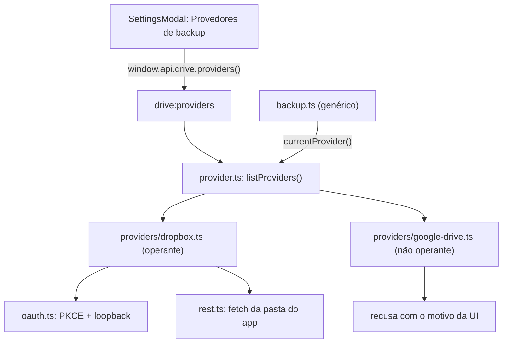

# Provedores de backup

Como o Chronos Biblioteca fala com a nuvem: um contrato único
(`BackupProvider`), um catálogo de provedores e o status de cada um. O guia do
Dropbox (OAuth, App folder, troubleshooting) continua em
[`dropbox.md`](dropbox.md).

## Situação hoje

| Provedor         | Situação                    | Destino do backup                                                            |
| ---------------- | --------------------------- | ---------------------------------------------------------------------------- |
| **Dropbox**      | **Operante** — único em uso | `/Apps/Chronos Biblioteca` (pasta visível na sua conta)                      |
| **Google Drive** | **Não operante**            | `appDataFolder` (**pasta oculta**, não aparece na interface do Google Drive) |

Em Configurações → **Provedores de backup** os dois aparecem: o Google Drive
com o selo _Não operante_ e o motivo logo abaixo, para o usuário nunca
achar que a integração já funciona.

### Por que o Google Drive ainda não está operante

1. **Exigências do Google ainda não atendidas**: a integração só pode ser
   publicada depois que o app passar pela verificação (tela de consentimento
   OAuth, revisão dos escopos e publicação no console do Google).
2. **A implementação não existe mais no código**: o OAuth/REST do Google Drive
   foi substituído pelo Dropbox na v1.1.0 (ver `CHANGELOG.md`).

Enquanto os dois pontos não forem resolvidos, o provedor fica com
`operational: false` e **toda operação é recusada** com o mesmo motivo que a
interface exibe (mensagem única em `src/main/drive/providers/google-drive.ts`).
Não há como “conectar” o Google Drive por engano.

### Pasta oculta no Google Drive (decisão de design)

Quando o Google Drive for ativado, o backup **grava na pasta oculta
`appDataFolder`** — e não em pasta visível:

- `appDataFolder` só existe pela API (escopo `drive.appdata`) e **não aparece
  na interface do Google Drive**: ninguém vê a pasta na conta, e o app nem
  enxerga o resto do Drive do usuário.
- É o mesmo espaço oculto que a integração original já usava (o Dropbox não
  oferece nada equivalente: a pasta do app fica visível em `/Apps/`).
- A decisão já está no catálogo: `storageTarget` descreve o destino e
  `storageHidden: true` gera o selo _Pasta oculta_ na interface.

## Arquitetura

| Arquivo                                    | Papel                                                                  |
| ------------------------------------------ | ---------------------------------------------------------------------- |
| `src/main/drive/provider.ts`               | Contrato `BackupProvider`, registro e `currentProvider()`              |
| `src/main/drive/providers/dropbox.ts`      | Adapter do OAuth/REST do Dropbox para o contrato                       |
| `src/main/drive/providers/google-drive.ts` | Stub **não operante**: motivo + destino oculto documentados            |
| `src/main/drive/backup.ts`                 | Orquestração genérica (não cita provedor algum)                        |
| `src/main/drive/crypto.ts`                 | Criptografia genérica (AES-256-GCM + nomes opacos)                     |
| `src/main/drive/state.ts`                  | Sessão em memória + `dropbox-tokens.json` (ainda única: só um conecta) |

O contrato é pequeno de propósito: `authorize()` + as 4 operações de arquivo
(`listAppFiles`, `uploadFile`, `downloadFile`, `deleteFile`). Criptografia,
manifesto e orquestração ficam fora, compartilhados por todos.

## Como ativar o Google Drive (ou um terceiro provedor)

1. Implementar OAuth (PKCE + loopback, mesmo desenho do Dropbox) e o REST do
   Drive em `src/main/drive/providers/` — **gravando em `appDataFolder`**,
   com a pasta oculta.
2. Marcar `operational: true` e zerar `unavailableReason` no catálogo.
3. Generalizar o estado: hoje `state.tokens` é único e `currentProvider()` é
   fixo no Dropbox; com dois provedores operantes, a sessão passa a ser por
   provedor e a escolha do usuário vale aqui.
4. Adicionar o seletor de provedor na UI (hoje não existe: só há um
   operante) e trocar o rótulo fixo “Dropbox” da pílula do cabeçalho por
   `DriveStatus`.
5. Testes: espelhar o `FakeDropbox` (`tests/helpers/drive.ts`) para o novo
   provedor e cobrir o caminho de backup/restauração ponta a ponta.

Enquanto só um provedor estiver operante, nada disso é necessário: o catálogo
já deixa o terreno pronto e o motivo visível para o usuário.
