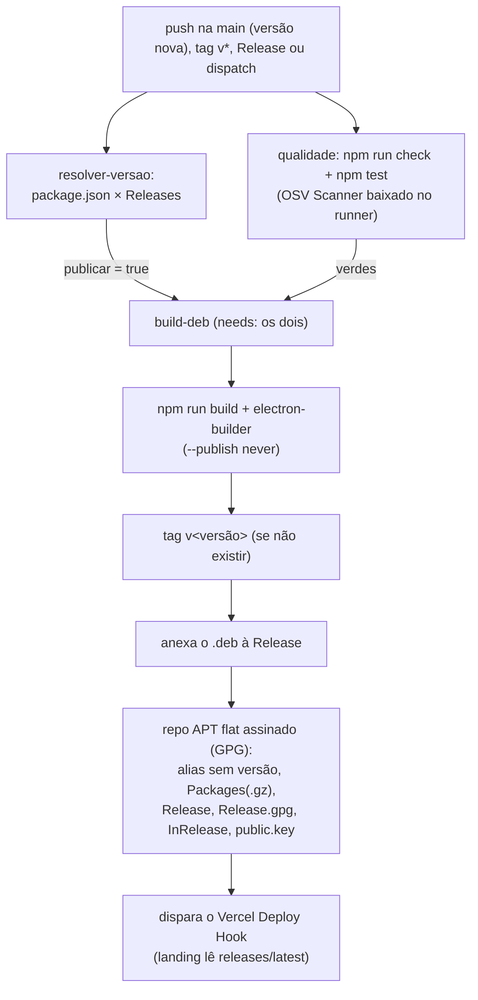

# Build, pacote e distribuição

O app é compilado com electron-vite (`main`, `preload` e `renderer`) e
empacotado em `.deb` pelo electron-builder. Nada disso entra no git: `out/`,
`release/` e `*.deb` estão no `.gitignore`.

## Comandos

| Comando                 | O que faz                                                |
| ----------------------- | -------------------------------------------------------- |
| `npm ci`                | dependências (lockfile exato)                            |
| `npm run dev`           | desenvolvimento com hot reload                           |
| `npm run build`         | apaga `out/` e compila os três bundles                   |
| `npm start`             | pré-visualiza o build (`electron-vite preview`)          |
| `npm run dist`          | build + gera o `.deb` em `release/` (precisa `fakeroot`) |
| `npm run dist:dir`      | idem, deixando a árvore descompactada (`--dir`)          |
| `npm run check`         | typecheck + lint + formato + auditoria OSV               |
| `npm test`              | suíte Vitest (`tests/`)                                  |
| `npm run test:coverage` | suíte com cobertura em `coverage/` (limiar de 50%)       |

Pré-requisitos: Node 24 + npm 11 e `fakeroot` no Linux para o `dist`. O binário
`bin/osv-scanner` (usado por `security:audit`) não é versionado; localmente
copie uma release (2.6.0) e no CI ele é baixado pelo próprio workflow.

## Saída do build

| Caminho                 | Conteúdo                                               |
| ----------------------- | ------------------------------------------------------ |
| `out/main/index.js`     | processo principal (bundled pelo Vite em SSR)          |
| `out/preload/index.cjs` | ponte `contextBridge` (CommonJS, exigida pelo sandbox) |
| `out/renderer/`         | HTML, CSS, fontes e JS da interface                    |
| `release/`              | `.deb` e árvore gerada pelo electron-builder           |

Os aliases `@zero/*` são resolvidos na hora do bundle
(`electron.vite.config.mts`), então o pacote não depende do `tsconfig` em
tempo de execução.

## O que vai dentro do `.deb`

Bloco `build` do `package.json`:

| Chave                 | Valor                                                                |
| --------------------- | -------------------------------------------------------------------- |
| `appId`               | `com.chronos.biblioteca`                                             |
| `target`              | `deb` para Linux (categoria Office, executável `chronos-biblioteca`) |
| `asar`                | ligado (o código vive no `app.asar`)                                 |
| `afterPack`           | `build/after-pack.cjs` (slim: locales e SwiftShader removidos)       |
| `deb.appArmorProfile` | `build/apparmor-profile` (perfil AppArmor real, não o decorativo)    |
| `deb.afterInstall`    | `build/scripts/after-install.sh` (dirs do cofre + PolicyKit)         |
| `deb.afterRemove`     | `build/postrm` (unload do perfil, alternatives e purge)              |
| `extraResources`      | `build/scripts/biblioteca-setup` → `resources/biblioteca-setup`      |
| `depends`             | GTK 3, libnotify, NSS, xss, xtst, xdg-utils, atspi e uuid            |
| `electronFuses`       | 6 fuses apertados (abaixo)                                           |

### Fuses (`electronFuses`)

| Fuse                                   | Valor   | Por quê                                                   |
| -------------------------------------- | ------- | --------------------------------------------------------- |
| `runAsNode`                            | `false` | não deixar `ELECTRON_RUN_AS_NODE` executar Node           |
| `enableNodeOptionsEnvironmentVariable` | `false` | bloqueia `NODE_OPTIONS` injetado por fora                 |
| `enableNodeCliInspectArguments`        | `false` | inspetor (`--inspect`) desligado                          |
| `enableCookieEncryption`               | `true`  | cookies cifrados no perfil                                |
| `onlyLoadAppFromAsar`                  | `true`  | código só do `app.asar`                                   |
| `grantFileProtocolExtraPrivileges`     | `false` | sem privilégios extra do `file://` (a SPA é `chronos://`) |

### `after-pack.cjs` (slim)

Remove do pacote o que o app não usa: `locales/` além de `pt-BR`, `pt-PT` e
`en-US` (fallback obrigatório do Chromium) e os binários SwiftShader/Vulkan
(sem WebGL). **Nunca** remover `libffmpeg.so`: o binário do Electron declara
`DT_NEEDED` nele e o app não abre sem o arquivo (lição da v1.1.1).

### Perfil AppArmor (`build/apparmor-profile`)

O `postinst` padrão do electron-builder copia o perfil para
`/etc/apparmor.d/chronos-biblioteca` e o carrega, **pulando** (sem falhar) onde
AppArmor é antigo (base < `abi/4.0`, ex.: Mint 22 sobre 22.04) ou ausente. Sem
essa chave, o que o `.deb` embutiria seria o perfil decorativo padrão
(`flags=(unconfined)`, que só dá nome ao processo). O perfil real confina o
processo instalado:

- **escrita** só nos diretórios do app no home (`.config`/`.local/share`/
  `.cache`/`.local/state/chronos-biblioteca`), no cofre de
  `/var/lib/.chronos-biblioteca` (raiz `r`, vault `rw`) e no helper do pacote;
- **leitura** do home ampla (o seletor de capa abre arquivo de qualquer pasta)
  com deny-list de credenciais (`.ssh`, `.gnupg`, chaveiros, perfis de
  navegador inclusive Brave, cofre/Cookies do Guardinha, `.aws`, `.docker`,
  `.kube`, `.netrc`, `.git-credentials`); os diretórios críticos têm regra de
  dir porque `/**` não cobre o próprio diretório;
- **exec** só do binário do pacote e do `xdg-open` (URLs externas);
- **rede** `inet`/`inet6` em `stream` e `dgram` (HTTPS e DNS do Dropbox) — sem
  sockets crudos; AppArmor clássico não filtra host de destino (aceito no
  `SECURITY.md`);
- base do Electron/GTK (namespaces, capabilities, `/proc`, abstrações X/Wayland,
  dbus e fontes).

**Limitação conhecida:** o perfil não dá `w` nos pais XDG (`~/.config`,
`~/.local/share`, `~/.cache`), de propósito — liberar o pai deixaria o app
capaz de criar entradas arbitrárias em `.config`. Numa sessão normal esses
diretórios já existem (o login os cria); só num home recém-criado o `mkdir`
inicial é negado e o app abre em modo degradado (a falha de persistência vira
`error` no log, sem derrubar a janela — ver `initApp` em `docs/arquitetura.md`).
Se esse cenário virar requisito, acrescente a regra de pai e registre o custo
de permissão aqui.

O perfil usa as macros `${executable}`/`${sanitizedProductName}`, que o
electron-builder substitui na hora do build. Validação de sintaxe local:

```bash
apparmor_parser --skip-kernel-load --debug build/apparmor-profile
```

**Ciclo de teste em uma máquina real (obrigatório após cada regra nova):**
carregar em modo complain (`sudo apparmor_parser -C -r
/etc/apparmor.d/chronos-biblioteca`), usar o app de ponta a ponta, ler as
negações (`journalctl -k | grep DENIED` ou `/var/log/kern.log`) e repetir até
zerar negações legítimas; só então voltar ao modo enforce
(`sudo apparmor_parser -r /etc/apparmor.d/chronos-biblioteca`). Negação
legítima é sinal de regra faltando, **nunca** de regra a remover. A remoção do
pacote (`postrm` abaixo) descarrega e apaga o perfil.

Dois aprendizados do ciclo real (2026-10-09, Linux Mint 22.3): as regras
`deny` explícitas da deny-list negam **sem** gerar linha no journal — valide
a deny-list com um teste de leitura direto (EACCES), não pelo log; e o
seletor de capa roda no `xdg-desktop-portal` do sistema, fora do confinamento
(a mediação do perfil acontece na leitura que o próprio app faz do arquivo
escolhido). O registro completo do ciclo está no `Doc/ROADMAP.md`.

### `after-install` (postinst) e o helper do cofre

`build/scripts/after-install.sh` é o `postinst` custom (`deb.afterInstall`),
com o template padrão do electron-builder **mais** o que o cofre precisa:

- `install -d -m 0711 root:root /var/lib/.chronos-biblioteca` (oculta, sem
  listagem) e `install -d -m 0700 <SUDO_UID|PKEXEC_UID>` para
  `/var/lib/.chronos-biblioteca/.vault` — se o instalador não for
  identificado, o app repara no primeiro uso;
- a ação do PolicyKit `com.chronos.biblioteca.setup-vault`
  (`/usr/share/polkit-1/actions/com.chronos.biblioteca.policy`), que autoriza
  **só** o helper do pacote (`annotate` com o caminho absoluto);
- normalização do dono/modo de `resources/biblioteca-setup` (o build pode
  gravar com outro dono; `pkexec` exige root e sem escrita do grupo).

O helper `build/scripts/biblioteca-setup` (copiado por `extraResources` para
`resources/`) roda como root via `pkexec`, **não** aceita caminho do chamador
e só cria os dois diretórios fixos com os modos acima, dando o dono do vault a
`PKEXEC_UID`. É ele que o `src/main/vault/privilege.ts` chama quando o app
não consegue escrever em `/var/lib`.

### `postrm` (after-remove)

Substitui o template padrão (via `deb.afterRemove`; roda pelo `writeConfigFile`,
que resolve os placeholders de nome). No No `remove` comum: remove o `update-alternatives`, **descarrega o perfil
AppArmor do kernel** e apaga o arquivo (sem isso a policy ficaria imposta até
o reboot), e apaga a ação do PolicyKit (fora do banco do dpkg). No `apt
purge`, apaga também os dados do usuário em todos os homes
(`.config`/`.local/share`/`.cache`/`.state/chronos-biblioteca`) **e o cofre
em `/var/lib/.chronos-biblioteca`** (decisão de produto: purge leva junto).
Pastas de marcas antigas (`Chronos Biblioteca`, `Webtoons Biblioteca`) não
são mais tocadas nem lidas.

## Integridade: check e testes antes do pacote

O gate **não é advisory**: o workflow `publish.yml` só chega ao
`electron-builder` depois de dois jobs verdes.

| Job               | O que roda                                                          |
| ----------------- | ------------------------------------------------------------------- |
| `resolver-versao` | confere `package.json` × Releases; decide se há o que publicar      |
| `qualidade`       | `npm ci` → baixa o OSV Scanner → `npm run check` → `npm test`       |
| `build-deb`       | `needs: [resolver-versao, qualidade]` → build + tag + Release + APT |

Falha de tipo, lint, formato, vulnerabilidade ou teste derruba o run **antes**
de qualquer tag ou asset existir. `resolver-versao` e `qualidade` rodam em
paralelo.

Localmente, o equivalente ao gate é:

```bash
npm ci && npm run check && npm test
```

## Fluxo do `publish.yml`



Detalhes da distribuição (por que o repo APT vive na Release, nomes dos
assets que **nunca** se renomeiam, troubleshooting do GPG):
[`distribuicao-apt.md`](distribuicao-apt.md). A landing nunca versiona
binário: o `fetch-release.mjs` dela lê `releases/latest` no build.

## Ver também

- [`distribuicao-apt.md`](distribuicao-apt.md) (Release + repo APT + landing)
- [`testes.md`](testes.md) (o que o gate de testes cobre)
- [`SECURITY.md`](../SECURITY.md) (fuses, CSP e permissões da sessão)
