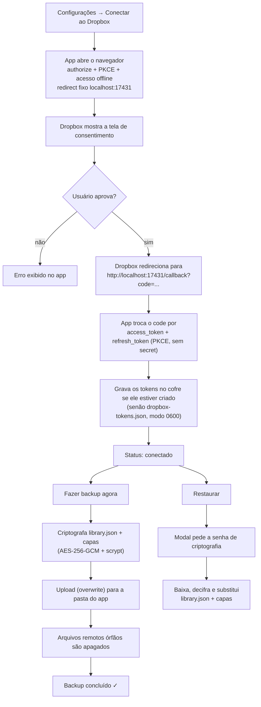
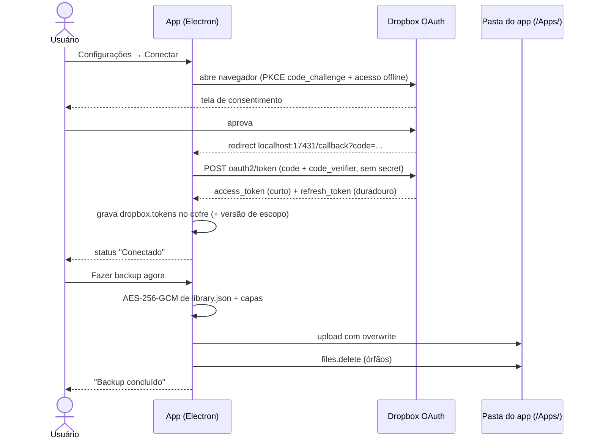

# Backup no Dropbox

Guia completo de como conectar o **Chronos Biblioteca** ao Dropbox e proteger sua
biblioteca na nuvem. O mapa dos provedores de backup (quem está operante e por
que o Google Drive ainda não) está em [`backup-providers.md`](backup-providers.md).

O app usa **OAuth 2.0 direto no aplicativo** (fluxo loopback + PKCE, sem servidor
intermediário e sem bibliotecas pesadas, apenas `fetch` nativo) e guarda tudo na
**pasta do app** (`/Apps/Chronos Biblioteca`), um espaço reservado que o Dropbox
cria para cada aplicativo. Todos os arquivos sobem **criptografados**
(AES-256-GCM). Com PKCE **não há segredo embutido**: só a App key identifica o
app; o segredo real é o `refresh_token`, guardado somente na sua máquina.

> Diferença importante para quem veio do Google Drive: a pasta do app **aparece**
> na sua conta (em `/Apps/`), ela não é invisível como era o `appDataFolder`.
> O que ninguém além de você vê é o _conteúdo_: nomes de arquivo opacos +
> tudo cifrado. Qualquer pessoa que abra a pasta encontra apenas blobs sem nome
> legível.

---

## Como funciona (diagrama)

---

## 1. Chave do aplicativo no Dropbox

> **A chave padrão já vem embutida no app** (`EMBEDDED_APP_KEY` em
> `src/main/drive/constants.ts`) e não há mais campo nas Configurações: dá para
> pular esta seção e conectar direto. A App key é identificador público de
> cliente OAuth; com PKCE não existe `app secret`, então embuti-la não cria
> segredo algum; o `refresh_token` continua só na sua máquina.
>
> Esta seção é para quem quiser rodar com um **app Dropbox próprio**
> (desenvolvimento): no lugar de campo na UI, o override é manual em
> `~/.config/chronos-biblioteca/settings.json`, preenchendo `driveClientId`
> com a sua chave (ele tem prioridade sobre a embutida).

Para criar o seu:

1. Acesse <https://www.dropbox.com/developers/apps> e clique em **Create app**.
2. Escolha **Scoped access** → **App folder**. É esse tipo que cria a pasta
   reservada `/Apps/<nome>`: o app enxerga **somente** ela, nunca o resto do
   seu Dropbox. Dê um nome (ex.: `Chronos Biblioteca`).
3. Na aba **Permissions**, marque exatamente:
   `account_info.read`, `files.metadata.read`, `files.metadata.write`,
   `files.content.read`, `files.content.write`.
   São permissões de arquivo comum, sem escopo restrito: nada de auditoria de
   segurança paga.
4. Na aba **Settings**, em **OAuth 2 → Redirect URIs**, cadastre exatamente:
   `http://localhost:17431/callback`
   O Dropbox só aceita URI http em `localhost` e exige o cadastro prévio; por
   isso o app usa sempre essa porta fixa em vez de sortear uma a cada conexão.
5. Copie a **App key** e, para usá-la, grave-a em
   `~/.config/chronos-biblioteca/settings.json` como `driveClientId`
   (ex.: `{"driveClientId": "sua-app-key"}`).

### Development × Production (limites reais do Dropbox)

| Situação    | O que acontece                                                                                                                                                                                                                                                                                                                        |
| ----------- | ------------------------------------------------------------------------------------------------------------------------------------------------------------------------------------------------------------------------------------------------------------------------------------------------------------------------------------- |
| Development | Funciona igual ao produção para até **500 contas vinculadas**. A partir de **50 contas**, abre uma janela de **2 semanas** para pedir e receber a aprovação de produção; sem ela, o app **para de aceitar contas novas** (quem já conectou continua funcionando). A revisão só começa após as 50 contas e costuma sair em dias úteis. |
| Production  | Botão **Apply for production** no App Console (descrever o uso + ícone). Sem auditoria de segurança paga para os escopos que usamos.                                                                                                                                                                                                  |

Para uso próprio e testes, Development basta. Se um dia o app estourar as 50
contas, é só pedir a produção, bem mais simples que a verificação do Google.

---

## 2. Conectar no aplicativo

1. Abra o Chronos Biblioteca → botão **⚙ Configurações** (canto superior direito).
2. Defina a **senha de criptografia do backup** (obrigatória; ver abaixo) e clique em **Salvar**.
3. Clique em **Conectar ao Dropbox**:
   - O navegador padrão abre a página de consentimento do Dropbox.
   - Após aprovar, o Dropbox redireciona para `http://localhost:17431/callback?code=...`.
   - O app captura o código, troca pelos tokens (PKCE) e mostra o status **Conectado**.
4. Os tokens são gravados no **cofre de segredos** quando ele existe
   (`dropbox.tokens`; ver [`cofre.md`](cofre.md)), senão em
   `~/.config/chronos-biblioteca/dropbox-tokens.json` (modo `0600`, caminho
   legado). O `refresh_token` do Dropbox é **duradouro** (só morre se você
   revogar): nada de reconectar a cada 7 dias.

> Se os escopos pedidos pelo app mudarem um dia, a sessão salva é invalidada e
> o app exibe “Permissões do Dropbox atualizadas. Reconecte a conta Dropbox.”:
> é só clicar em Conectar de novo.

---

## 3. Backup e restauração

| Botão                  | O que faz                                                                                                   |
| ---------------------- | ----------------------------------------------------------------------------------------------------------- |
| **Fazer backup agora** | Criptografa `library.json` e todas as capas e envia para a pasta do app (substitui tudo).                   |
| **Restaurar**          | Abre o modal da **senha de criptografia**, baixa o backup, decifra e **substitui** a biblioteca local.      |
| **Desconectar**        | Apaga os tokens locais (segredo do cofre, ou `dropbox-tokens.json` no legado). O backup na nuvem permanece. |

- **Criptografia é obrigatória**: sem senha de criptografia definida nas Configurações, o
  backup é recusado com a mensagem “Defina uma senha de criptografia do backup nas
  configurações.”.
- **O que fica na nuvem**: como a pasta do app é visível na sua conta, nada nela
  entrega o conteúdo: nomes **opacos** (HMAC-SHA256 com chave de nomes derivada
  da senha e de um **salt aleatório guardado no manifesto cifrado**; nem
  `library.json` aparece em claro) + um **manifesto cifrado** que mapeia nome
  remoto → nome local + conteúdos sempre cifrados (AES-256-GCM com chave
  derivada por scrypt). Para o Dropbox (e para quem bisbilhotar sua conta)
  restam só a quantidade aproximada e o tamanho dos blobs.
- **Espaço**: o backup típico (um JSON + capas) ocupa poucos megabytes e cabe com
  folga até no plano gratuito do Dropbox.
- **Conflitos**: o backup é sempre _sobrescrever por completo_: o último backup vence.
- **Restaurar sem senha**: se algum arquivo não estiver cifrado (formato muito antigo),
  o modal aceita confirmação em branco para ele; senha errada mostra “Senha de
  criptografia incorreta ou backup corrompido.”.
- **Zerar o backup na nuvem**: apague a pasta `/Apps/Chronos Biblioteca` pelo
  Dropbox Web e faça um backup novo.
- Os backups são disparados **manualmente** pelo botão _Fazer backup agora_.

---

## Solução de problemas

| Sintoma                                                            | Causa provável / solução                                                                                                                                                                                              |
| ------------------------------------------------------------------ | --------------------------------------------------------------------------------------------------------------------------------------------------------------------------------------------------------------------- |
| “Configure a chave do aplicativo Dropbox…”                         | Este build saiu sem chave embutida e o `settings.json` não tem `driveClientId`. Rebuild com a chave ou preencha o campo no arquivo (§1).                                                                              |
| `redirect_uri_mismatch` ao conectar                                | A URI `http://localhost:17431/callback` não está em **Redirect URIs** no App Console, ou o `driveClientId` do `settings.json` é de outro app. Confira.                                                                |
| Porta `17431` ocupada ao conectar                                  | Outro programa usa a porta do callback. Feche-o e tente de novo (o app é de instância única, então normalmente é outra coisa).                                                                                        |
| “Permissões do Dropbox atualizadas. Reconecte a conta Dropbox.”    | Os escopos pedidos pelo app mudaram. Clique em **Conectar ao Dropbox** de novo (uma vez).                                                                                                                             |
| “Faltam permissões no app Dropbox…” ao conectar ou no backup       | Nem todas as caixas da aba **Permissions** estão marcadas, ou a sessão foi concedida antes de marcar. Marque os 5 escopos (§1), **Desconecte** e **Conecte de novo**; concessão antiga não ganha escopo novo sozinha. |
| “Defina uma senha de criptografia do backup…”                      | Nenhuma senha definida em Configurações. Preencha o campo **Senha de criptografia do backup** e **Salvar**.                                                                                                           |
| “Este backup está criptografado. Informe a senha de criptografia.” | A senha digitada no modal estava em branco. Informe a senha usada no backup.                                                                                                                                          |
| “Senha de criptografia incorreta ou backup corrompido.”            | Senha errada no modal de restauração (ou arquivo corrompido).                                                                                                                                                         |
| “Muitas tentativas de restauração com senha errada…”               | Trava exponencial: a partir da 3ª falha seguida a espera sobe 10 s → 30 s → 1 min → 5 min → 15 min. Erro de rede não conta e um restore certo zera a trava.                                                           |
| Erro de rede / `Erro do Dropbox (HTTP …)`                          | Sem conexão, proxy/VPN bloqueando, ou cota do Dropbox estourada. Tente novamente.                                                                                                                                     |
| Janela abre mas nada acontece após consentir                       | O navegador não conseguiu voltar para `localhost:17431` (porta bloqueada). Feche e tente de novo.                                                                                                                     |
| “Fazer backup” falha / nada local                                  | A base local ainda não existe (instalação nova). Adicione ao menos uma obra antes de fazer o backup.                                                                                                                  |
| App reinstalado localmente                                         | Os tokens vão embora com `~/.config/chronos-biblioteca/`; reconecte: o backup na nuvem é reaproveitado.                                                                                                               |

---

## Segurança

- Os tokens ficam **somente na sua máquina**: no cofre de segredos (`dropbox.tokens`, sob a senha mestra; ver [`cofre.md`](cofre.md)) quando ele existe, ou em `configDir/dropbox-tokens.json` com modo `0600` no caminho legado. Nunca em repositório.
- **Sem segredo embutido**: com PKCE o `app secret` nem entra no fluxo. A App key é pública por definição e a proteção vem do PKCE + loopback. O segredo de verdade é o `refresh_token`, que nunca sai da sua máquina. Para revogar tudo, desconecte no app **e** remova o app em <https://www.dropbox.com/account/security>.
- Escopo mínimo: só a **pasta do app** (App folder; o app nem fica sabendo que o resto do seu Dropbox existe) + leitura do e-mail da conta (só para exibir qual conta está conectada).
- **Criptografia obrigatória** no cliente: AES-256-GCM com chave derivada por scrypt (`N=2¹⁷`, mínimo do OWASP; salt e IV aleatórios por arquivo, autenticação GCM), e o Dropbox guarda apenas blobs cifrados de nome opaco.
- Nenhum dado passa por servidor de terceiros: as chamadas vão do seu PC direto para o Dropbox (`api.dropboxapi.com`, `content.dropboxapi.com`).

---

## Migrado do Google Drive?

As sessões do provedor anterior **não são reaproveitadas**: o arquivo
`drive-tokens.json` é descartado na primeira inicialização. Conecte a conta
Dropbox e faça um backup novo: os dados locais (`library.json`, capas, senha)
são mantidos. Os backups antigos no Google Drive não são lidos nem apagados
pelo app; remova-os por lá se quiser.
