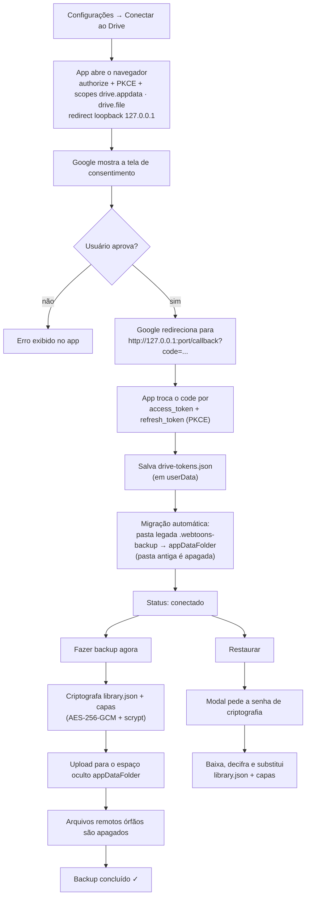
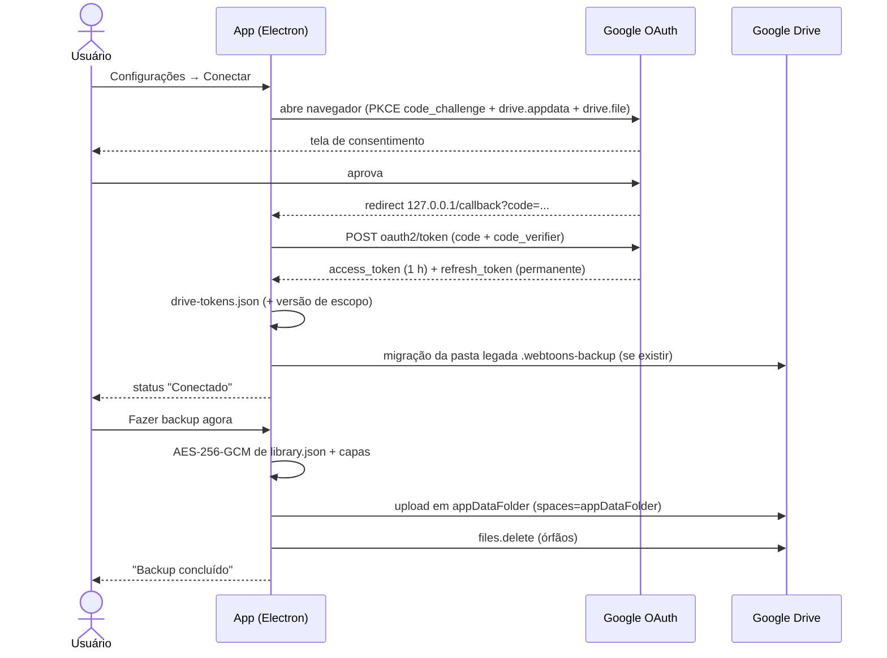

# Backup no Google Drive

Guia completo de como conectar o **Webtoons Biblioteca** ao Google Drive e proteger sua
biblioteca na nuvem.

O app usa **OAuth 2.0 direto no aplicativo** (fluxo loopback + PKCE, sem servidor intermediário
e sem bibliotecas pesadas — apenas `fetch` nativo), com **credenciais já embutidas** e guarda
tudo no **espaço oculto `appDataFolder`**, invisível na interface do Drive e acessível apenas
por este aplicativo. Todos os arquivos sobem **criptografados** (AES-256-GCM).

---

## Como funciona (diagrama)

---

## 1. Credenciais no Google Cloud

> **Não é preciso nada disso para usar o app.** Ele já vem com credenciais OAuth embutidas —
> os campos de Client ID/Secret nas Configurações são **opcionais**, apenas para quem quiser
> usar um projeto Google Cloud próprio (ou reconstruir o app).

Só se você quiser o seu próprio projeto (mesmo fluxo):

1. Acesse <https://console.cloud.google.com/> e crie (ou selecione) um projeto.
2. **APIs e serviços → Biblioteca** → ative **Google Drive API**.
3. **APIs e serviços → Credenciais → Criar credenciais → ID do cliente OAuth**.
   - Tipo de aplicativo: **Aplicativo para computador** (_Desktop app_).
4. Anote o **ID do cliente** e a **Chave secreta** e cole nas Configurações (campos opcionais).
5. **APIs e serviços → Tela de consentimento OAuth**:
   - Tipo de usuário: **Externo** (para uso próprio).
   - **Data Access**: adicione o escopo `https://www.googleapis.com/auth/drive.appdata`
     (sem ele, a conexão falha com `invalid_scope`). Os demais escopos usados pelo app —
     `drive.file`, `openid`, `email` — já são padrão/non-sensitive.
   - **Usuários testadores**: adicione seu e-mail.

### Escopos usados pelo app

| Escopo             | Serve para                                                             |
| ------------------ | ---------------------------------------------------------------------- |
| `drive.appdata`    | Ler/gravar no espaço oculto `appDataFolder` (o backup fica só nele)    |
| `drive.file`       | Arquivos criados pelo próprio app (usado no fluxo legado/pasta antiga) |
| `openid` + `email` | Identificar a conta e exibir o e-mail conectado na Configurações       |

Todos são **non-sensitive**: não exigem verificação de escopo sensível — apenas a verificação
básica do app (nome, política de privacidade) quando você sair do modo _Testing_.

### Testing × Produção

| Situação | O que exige                                                                                                                                                                                                                                                    |
| -------- | -------------------------------------------------------------------------------------------------------------------------------------------------------------------------------------------------------------------------------------------------------------- |
| Testing  | Usuário logado na lista de testadores (até 100 usuários). **Suficiente para uso próprio.**                                                                                                                                                                     |
| Produção | Página inicial **e** política de privacidade publicadas em **domínio próprio** verificado no Google Search Console (upload de arquivo HTML — funciona com GitHub Pages/Cloudflare Pages), domínio em **Authorized domains** e submissão da verificação básica. |

Enquanto a homepage/privacy não existem, mantenha o app em **Testing** — nada no app muda,
apenas a lista de usuários permitidos.

---

## 2. Conectar no aplicativo

1. Abra o Webtoons Biblioteca → botão **⚙ Configurações** (canto superior direito).
2. Defina a **senha de criptografia do backup** (obrigatória — ver abaixo) e clique em **Salvar**.
3. Clique em **Conectar ao Drive** (os campos de Client ID/Secret ficam em branco: o app usa as
   credenciais embutidas):
   - O navegador padrão abre a página de consentimento do Google.
   - Após aprovar, o Google redireciona para `http://127.0.0.1:<porta>/callback?code=...`.
   - O app captura o código, troca pelos tokens (PKCE) e mostra o status **Conectado**.
4. Os tokens ficam em `~/.config/Webtoons Biblioteca/drive-tokens.json`
   (`refresh_token` é usado automaticamente quando o `access_token` expira).
5. Na primeira conexão o app **migra sozinho** qualquer backup antigo da pasta
   `.webtoons-backup` para o `appDataFolder` e apaga a pasta antiga.

> Se os escopos do app mudarem, a sessão salva é invalidada e o app exibe
> “Permissões do Google atualizadas. Reconecte a conta Google.” — é só clicar em Conectar de novo.

---

## 3. Backup e restauração

| Botão                  | O que faz                                                                                                  |
| ---------------------- | ---------------------------------------------------------------------------------------------------------- |
| **Fazer backup agora** | Criptografa `library.json` e todas as capas e envia para o espaço oculto `appDataFolder` (substitui tudo). |
| **Restaurar do Drive** | Abre o modal da **senha de criptografia**, baixa o backup, decifra e **substitui** a biblioteca local.     |
| **Desconectar**        | Apaga `drive-tokens.json` local. O backup na nuvem permanece.                                              |

- **Criptografia é obrigatória**: sem senha de criptografia definida nas Configurações, o
  backup é recusado com a mensagem “Defina uma senha de criptografia do backup nas
  configurações.”.
- **Arquivos no Drive**: `library.json` + `covers/<nome>.png|jpg`, sempre cifrados
  (AES-256-GCM com chave derivada por scrypt), dentro do **`appDataFolder`** — que não aparece
  na interface do Drive e só este app acessa.
- **Conflitos**: o backup é sempre _sobrescrever por completo_ — o último backup vence.
- **Restaurar sem senha**: se o backup não estiver cifrado (criado por versões antigas), o
  modal aceita confirmação em branco; se estiver, a senha errada mostra “Senha de criptografia
  incorreta ou backup corrompido.”.
- **Zerar o backup na nuvem**: no Drive web, _Configurações → Gerenciar apps → Webtoons
  Biblioteca → desconectar_ apaga também o conteúdo do `appDataFolder` (é removido quando o
  usuário desconecta/desinstala o app). Depois é só fazer um backup novo.
- Os backups são disparados **manualmente** pelo botão _Fazer backup agora_.

---

## Solução de problemas

| Sintoma                                                            | Causa provável / solução                                                                                                                  |
| ------------------------------------------------------------------ | ----------------------------------------------------------------------------------------------------------------------------------------- |
| `invalid_scope` ao conectar                                        | O escopo `drive.appdata` não está em **Data Access** no Cloud Console (necessário no projeto próprio). Adicione e tente de novo.          |
| `redirect_uri_mismatch` ao conectar                                | O ID do cliente é de outro tipo de app. Precisa ser **Aplicativo para computador**.                                                       |
| `invalid_client` / erro 401 no backup                              | Client ID/Secret incorretos no projeto próprio. Em branco, o app usa as credenciais embutidas.                                            |
| “Permissões do Google atualizadas. Reconecte a conta Google.”      | Os escopos do app mudaram. Clique em **Conectar ao Drive** de novo (uma vez).                                                             |
| “Defina uma senha de criptografia do backup…”                      | Nenhuma senha definida em Configurações. Preencha o campo **Senha de criptografia do backup** e **Salvar**.                               |
| “Este backup está criptografado. Informe a senha de criptografia.” | A senha digitada no modal estava em branco. Informe a senha usada no backup.                                                              |
| “Senha de criptografia incorreta ou backup corrompido.”            | Senha errada no modal de restauração (ou arquivo corrompido).                                                                             |
| “Fanout/​Upload failed” ou erro de rede                            | Sem conexão, proxy/VPN bloqueando, ou cota da Drive. Tente novamente.                                                                     |
| Janela abre mas nada acontece após consentir                       | O navegador não conseguiu voltar para `127.0.0.1` (porta bloqueada). Feche e tente de novo — uma porta livre é escolhida automaticamente. |
| “Fazer backup” falha / nada local                                  | A base local ainda não existe (instalação nova). Adicione ao menos uma obra antes de fazer o backup.                                      |
| Backup antigo em `.webtoons-backup` não aparece                    | Sem problema: a migração para o `appDataFolder` roda sozinha na primeira conexão e apaga a pasta antiga.                                  |
| App reinstalado localmente                                         | Os tokens vão embora com `~/.config/Webtoons Biblioteca/`; reconecte — o backup na nuvem é reaproveitado.                                 |

---

## Segurança

- Os tokens ficam **somente na sua máquina** (`userData/drive-tokens.json`), nunca em repositório
  (o `.gitignore` cobre `userData/` e `release/`).
- **Credenciais embutidas**: o `client_secret` de um app Desktop não é um segredo real (é
  público por definição; a proteção vem do PKCE + loopback). Quem quiser usar projeto próprio
  sobrescreve os campos nas Configurações.
- Escopo mínimo: `drive.appdata` (só os dados do app) + `drive.file` (arquivos que ele mesmo
  criou) + `openid email` (exibição do e-mail conectado).
- **Criptografia obrigatória** no cliente: AES-256-GCM com chave derivada por scrypt (salt e IV
  aleatórios por arquivo, autenticação GCM) — o Google guarda apenas o blob cifrado.
- Nenhum dado passa por servidor de terceiros: as chamadas vão do seu PC direto para o Google
  (`www.googleapis.com/drive/v3/...`).
