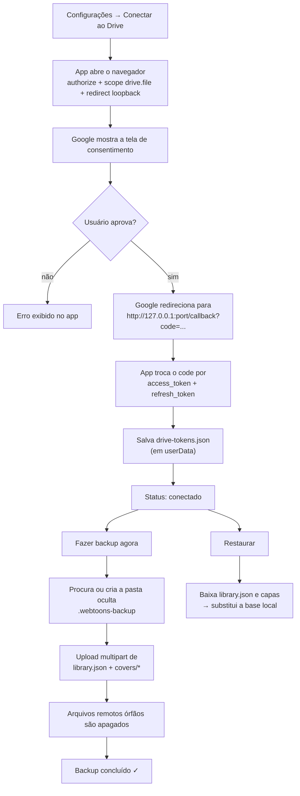
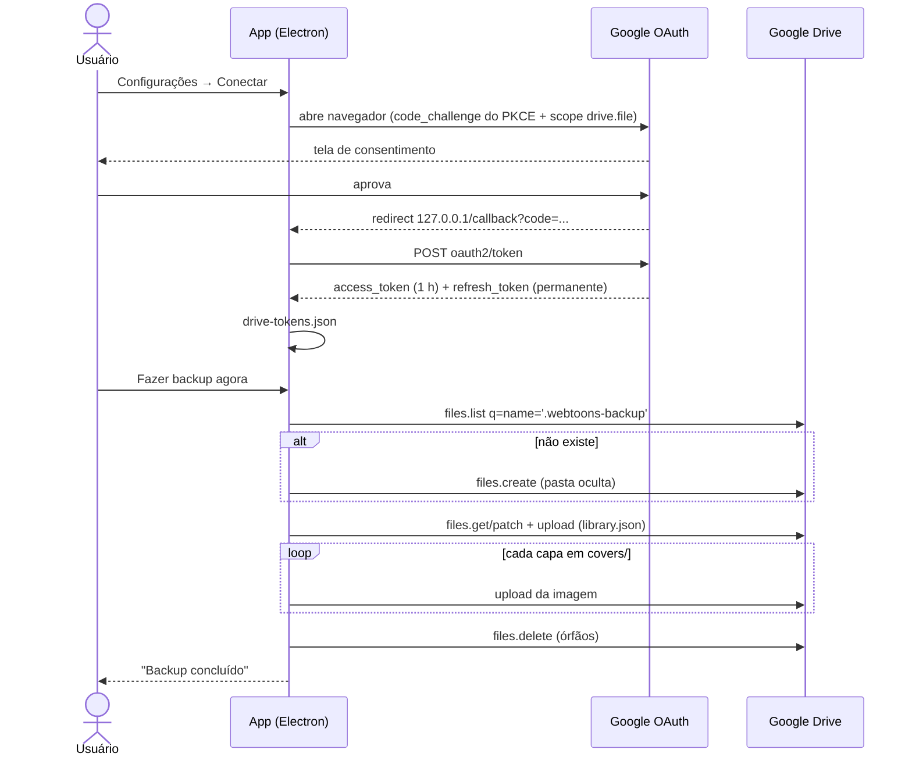

# Backup no Google Drive

Guia completo de como conectar o **Webtoons Biblioteca** ao Google Drive e proteger sua
biblioteca na nuvem.

O app usa **OAuth 2.0 direto no aplicativo** (fluxo de dispositivo/loopback, sem servidor
intermediário e sem bibliotecas pesadas — apenas `fetch` nativo) e grava tudo em **uma pasta
oculta** chamada `.webtoons-backup`.

---

## Como funciona (diagrama)

---

## 1. Criar as credenciais no Google Cloud

1. Acesse <https://console.cloud.google.com/> e crie (ou selecione) um projeto.
2. **APIs e serviços → Biblioteca** → ative **Google Drive API**.
3. **APIs e serviços → Credenciais → Criar credenciais → ID do cliente OAuth**.
   - Tipo de aplicativo: **Aplicativo para computador** (_Desktop app_).
4. Anote o **ID do cliente** e a **Chave secreta**.
5. **APIs e serviços → Tela de consentimento OAuth**:
   - Tipo de usuário: **Externo** (para uso próprio) e publique o app.
   - Adicione seu e-mail em _Usuários testadores_ (ou publique).

> O escopo usado pelo app é `drive.file`: o Google permite que ele leia e escreva **apenas os
> arquivos que ele mesmo criou** (a pasta `.webtoons-backup` e o que está dentro dela). Ele não
> tem acesso ao restante da sua Drive.

---

## 2. Conectar no aplicativo

1. Abra o Webtoons Biblioteca → botão **⚙ Configurações** (canto superior direito).
2. Cole **Client ID** e **Client Secret** → **Salvar**.
3. Clique em **Conectar ao Drive**:
   - O navegador padrão abre a página de consentimento do Google.
   - Após aprovar, o Google redireciona para `http://127.0.0.1:<porta>/callback?code=...`.
   - O app captura o código, troca pelos tokens e mostra o status **Conectado**.
4. Os tokens ficam em `~/.config/Webtoons Biblioteca/drive-tokens.json`
   (`refresh_token` é usado automaticamente quando o `access_token` expira).

---

## 3. Backup e restauração

| Botão                  | O que faz                                                                                             |
| ---------------------- | ----------------------------------------------------------------------------------------------------- |
| **Fazer backup agora** | Envia `library.json` e todas as capas para `.webtoons-backup` no Drive (substitui a versão anterior). |
| **Restaurar do Drive** | Baixa o backup e **substitui** a biblioteca local (`library.json` + `covers/`) após confirmação.      |
| **Desconectar**        | Apaga `drive-tokens.json`. A pasta no Drive permanece lá.                                             |

Os backups são disparados manualmente (há também backup automático ao fechar o app, caso esteja
conectado e a base tenha mudado).

- **Arquivos no Drive**: `library.json`, `covers/<nome>.png|jpg` — tudo dentro de
  `.webtoons-backup` (oculta: no app oficial da Drive ela só aparece com _Configurações →
  Mostrar itens ocultos_).
- **Conflitos**: o backup é sempre _sobrescrever por completo_ — o último backup vence.
- Para começar do zero na nuvem: delete a pasta `.webtoons-backup` pelo Drive (mostre itens
  ocultos) e faça um novo backup.

---

## Solução de problemas

| Sintoma                                      | Causa provável / solução                                                                                                                  |
| -------------------------------------------- | ----------------------------------------------------------------------------------------------------------------------------------------- |
| "redirect_uri_mismatch" ao conectar          | O ID do cliente é de outro tipo de app. Precisa ser **Aplicativo para computador**.                                                       |
| "invalid_client" / erro 401 no backup        | Client ID/Secret incorretos ou o app do Cloud Console foi apagado. Cole novamente em Configurações.                                       |
| "Fanout/​Upload failed" ou erro de rede      | Sem conexão, proxy/VPN bloqueando, ou cota da Drive. Tente novamente.                                                                     |
| Janela abre mas nada acontece após consentir | O navegador não conseguiu voltar para `127.0.0.1` (porta bloqueada). Feche e tente de novo — uma porta livre é escolhida automaticamente. |
| "Restaurar" falha                            | O backup está vazio ou corrompido. Verifique se existe `library.json` dentro de `.webtoons-backup`.                                       |
| App desinstalado                             | Os tokens vão embora com `~/.config/Webtoons Biblioteca/`; recrie a conexão — a pasta no Drive é reaproveitada pelo mesmo nome.           |

---

## Segurança

- Os tokens ficam **somente na sua máquina** (`userData/drive-tokens.json`), nunca em repositório
  (o `.gitignore` cobre `userData/` e `release/`).
- Escopo mínimo: `drive.file` + `openid email` (e-mail apenas para exibição do status).
- Nenhum dado passa por servidor de terceiros: as chamadas vão do seu PC direto para o Google
  (`www.googleapis.com/drive/v3/...`).
